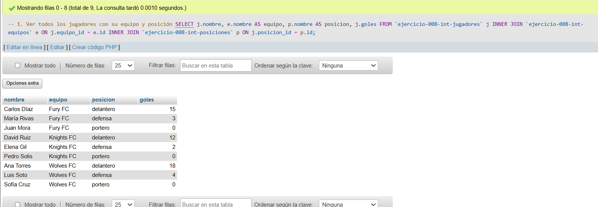
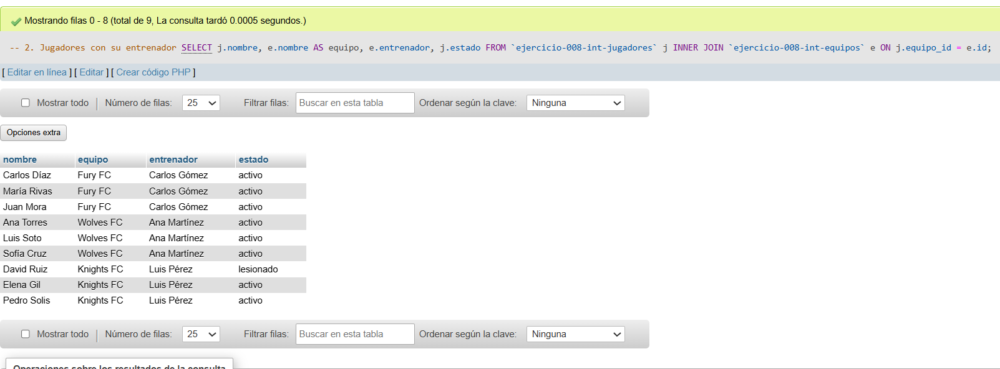
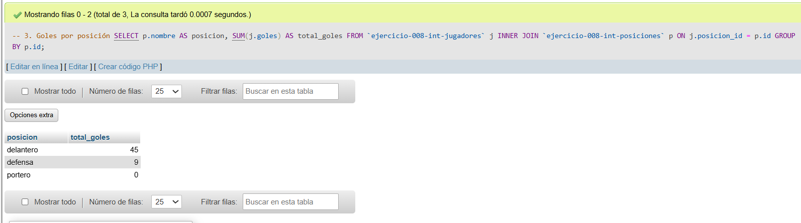
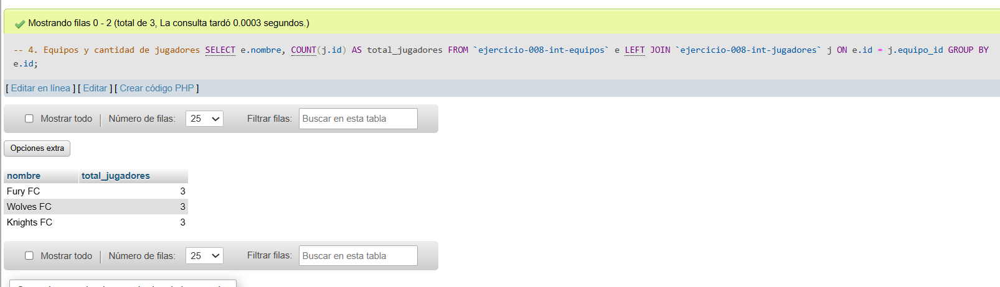
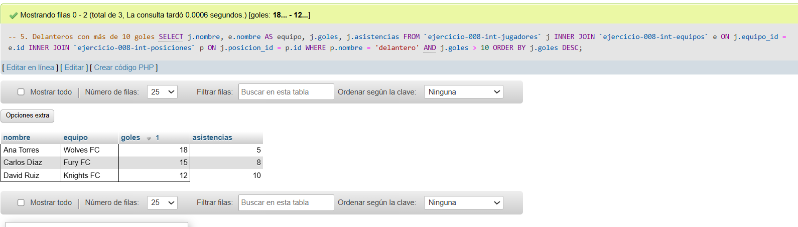

# Ejercicio 008 - Nivel Intermedio - Normalización 3FN Fútbol Sala

## 1. Temática

Normalización a 3FN de fútbol sala, eliminando dependencias transitivas en la estructura de datos.

## 2. Decisiones Técnicas

- **Diseño de Tablas (DDL):**
  - 3 tablas normalizadas:
    - `ejercicio-008-int-equipos`: información de equipos y entrenadores.
    - `ejercicio-008-int-posiciones`: catálogo de posiciones.
    - `ejercicio-008-int-jugadores`: datos de jugadores con llaves foráneas.
  - Llaves foráneas para integridad referencial.
  - `UNIQUE` en nombres de equipos y posiciones.
  - Uso de comillas invertidas para nombres con guiones.

- **Normalización 3FN aplicada:**
  - **1FN ya aplicada:** Valores atómicos.
  - **2FN ya aplicada:** Sin dependencias parciales.
  - **3FN aplicada:** Eliminar dependencias transitivas.
    - Antes: jugadores con equipo_nombre, entrenador (dependencia transitiva: jugador → equipo → entrenador).
    - Ahora: entrenador está en tabla equipos, no en jugadores.
  - **Posiciones independientes:** Tabla separada para evitar redundancia.

- **Inserción de Datos (DML):**
  - 3 equipos con entrenadores.
  - 3 posiciones (delantero, defensa, portero).
  - 9 jugadores con relaciones correctas.

- **Consultas (DQL):**
  - INNER JOIN múltiple para mostrar datos completos.
  - GROUP BY para estadísticas por posición.
  - LEFT JOIN para equipos sin jugadores.
  - Filtros combinados con ORDER BY.

## 3. Evidencias

*A continuación, se adjuntan capturas de pantalla que demuestran la ejecución y los resultados de los scripts SQL en phpMyAdmin.*

Definición de tablas e inserción de datos

Consulta 1

Consulta 2

Consulta 3

Consulta 4

Consulta 5
