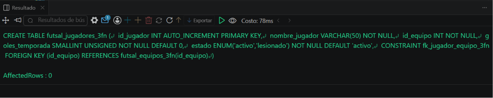
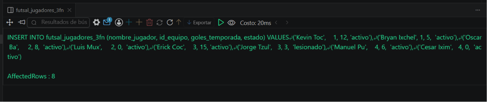
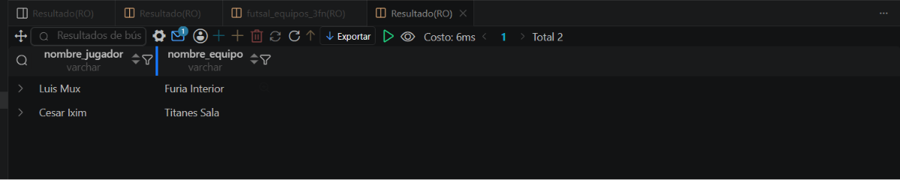

# Resolucion - Ejercicio 008 (Intermedio) - Selvin Lem

## Tematica
Futbol sala

## Como ejecutar
1. Ejecutar `ddl/schema.sql`: crea futsal_equipos_3fn y
   futsal_jugadores_3fn (FK a equipos). Diseño incorrecto queda
   solo comentado como referencia.
2. Ejecutar `dml/inserts.sql`: inserta 4 equipos y 8 jugadores.
3. Ejecutar `dql/consultas.sql`: incluye un UPDATE sobre el equipo
   que demuestra la ventaja de eliminar la dependencia transitiva.

## Entidad principal
- Tablas: futsal_equipos_3fn, futsal_jugadores_3fn (FK a equipos)
- Atributos clave: nombre_equipo, ciudad, estadio, nombre_jugador

## Restriccion aplicada
FOREIGN KEY id_equipo en futsal_jugadores_3fn, eliminando la
dependencia transitiva de ciudad/estadio respecto al jugador.

## Caso limite incluido
Jugadores con 0 goles en equipos distintos; el UPDATE del estadio
de un equipo se refleja para todos sus jugadores sin duplicar datos
ni riesgo de inconsistencia entre filas.

## Evidencia ejecucion - schema.sql
 

## Evidencia ejecucion - inserts.sql
 
 
## Evidencia ejecucion - consultas.sql
 