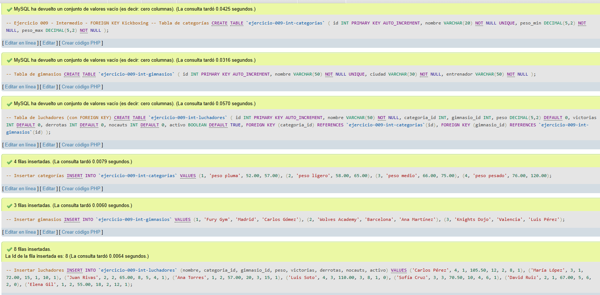
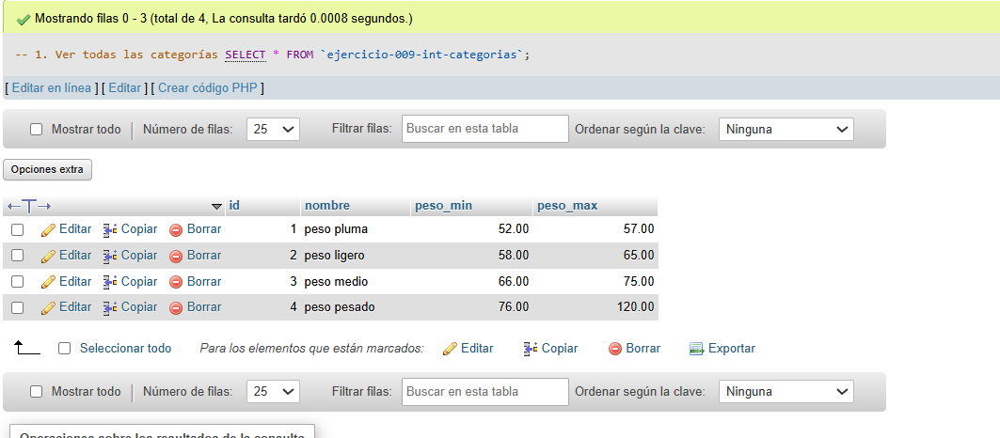
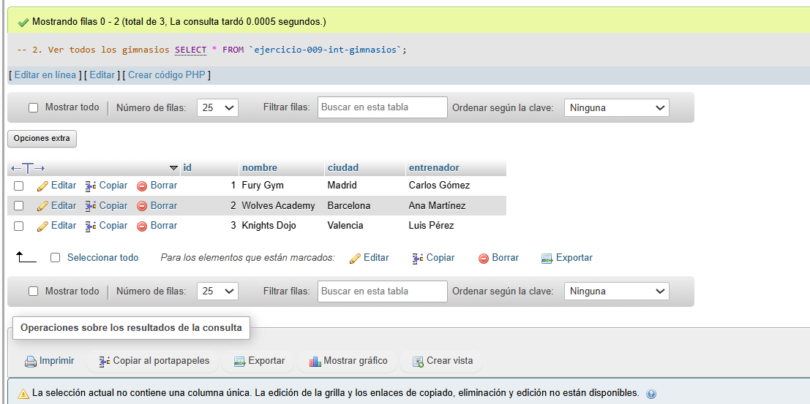
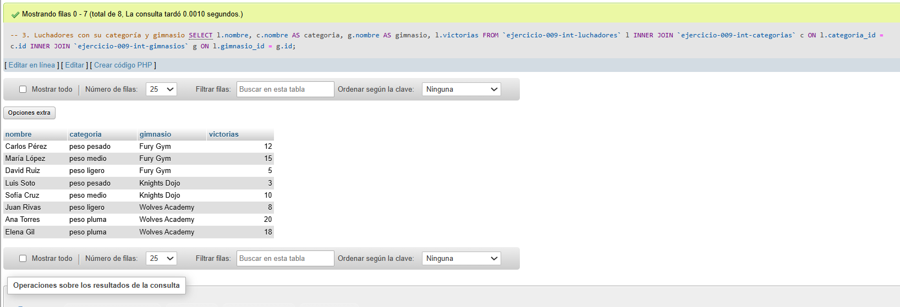
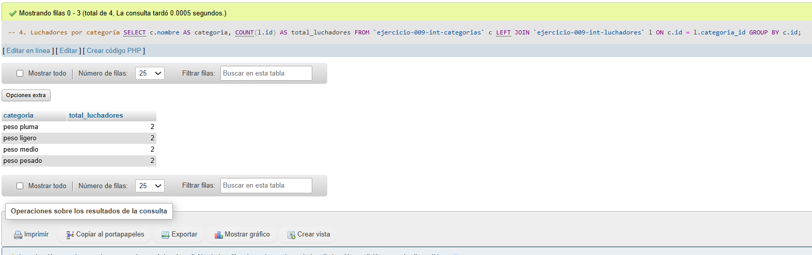
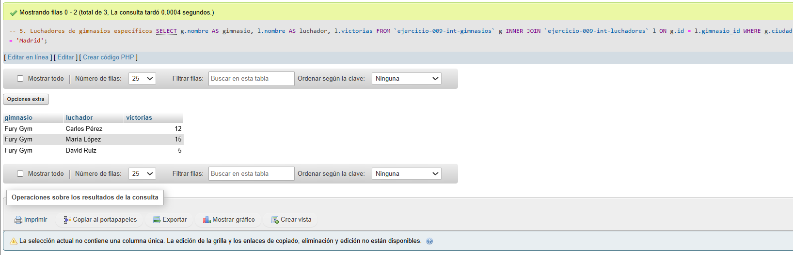
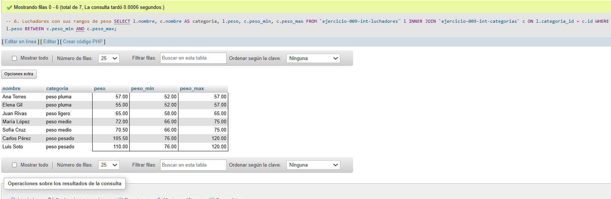

# Ejercicio 009 - Nivel Intermedio - FOREIGN KEY Kickboxing

## 1. Temática

Kickboxing con FOREIGN KEY para mantener integridad referencial entre luchadores, categorías y gimnasios.

## 2. Decisiones Técnicas

- **Diseño de Tablas (DDL):**
  - 3 tablas relacionadas:
    - `ejercicio-009-int-categorias`: Catálogo de categorías por peso.
    - `ejercicio-009-int-gimnasios`: Información de gimnasios.
    - `ejercicio-009-int-luchadores`: Datos de luchadores con FOREIGN KEY.
  - Llaves foráneas:
    - `categoria_id` → `ejercicio-009-int-categorias(id)`
    - `gimnasio_id` → `ejercicio-009-int-gimnasios(id)`
  - `UNIQUE` en nombres para evitar duplicados.
  - Uso de comillas invertidas para nombres con guiones.

- **Ventajas de FOREIGN KEY:**
  - Integridad referencial garantizada.
  - Evita registros huérfanos.
  - Cascada en eliminaciones/actualizaciones (opcional).
  - Mejora la consistencia de datos.

- **Inserción de Datos (DML):**
  - 4 categorías con rangos de peso.
  - 3 gimnasios en diferentes ciudades.
  - 8 luchadores con relaciones correctas.

- **Consultas (DQL):**
  - INNER JOIN para mostrar datos relacionados.
  - LEFT JOIN para incluir categorías sin luchadores.
  - Filtros por ciudad y condiciones de peso.
  - Verificación de integridad con BETWEEN.

## 3. Evidencias

*A continuación, se adjuntan capturas de pantalla que demuestran la ejecución y los resultados de los scripts SQL en phpMyAdmin.*

Definición de tablas e inserción de datos

Consulta 1

Consulta 2

Consulta 3

Consulta 4

Consulta 5

Consulta 6

