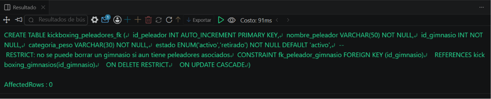

# Resolucion - Ejercicio 009 (Intermedio) - Selvin Lem

## Tematica
Kickboxing

## Como ejecutar
1. Ejecutar `ddl/schema.sql`: crea kickboxing_gimnasios y
   kickboxing_peleadores_fk con FOREIGN KEY (RESTRICT/CASCADE).
2. Ejecutar `dml/inserts.sql`: inserta 4 gimnasios y 8 peleadores;
   incluye 2 intentos que deben fallar por la FK.
3. Ejecutar `dql/consultas.sql` para confirmar que ambos casos
   limite fueron bloqueados correctamente.

## Entidad principal
- Tablas: kickboxing_gimnasios, kickboxing_peleadores_fk (FK)
- Atributos clave: id_gimnasio, nombre_peleador, categoria_peso

## Restriccion aplicada
FOREIGN KEY con ON DELETE RESTRICT (evita borrar gimnasio con
peleadores) y ON UPDATE CASCADE.

## Caso limite incluido
1) INSERT con id_gimnasio inexistente (99), rechazado por la FK.
2) DELETE de un gimnasio con peleadores activos, rechazado por
   ON DELETE RESTRICT. Ambos verificados en dql/consultas.sql.

## Evidencia ejecucion - schema.sql
 
 
## Evidencia ejecucion - inserts.sql
 
