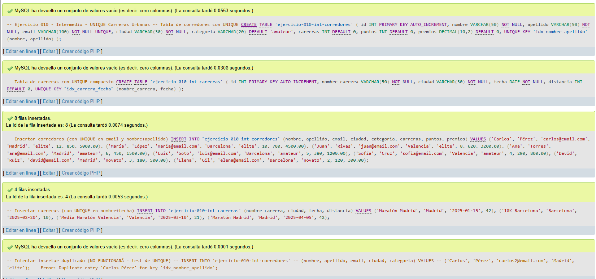
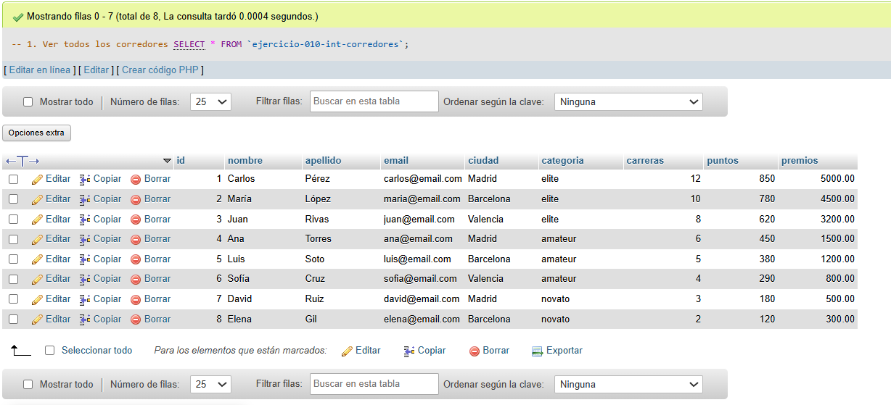
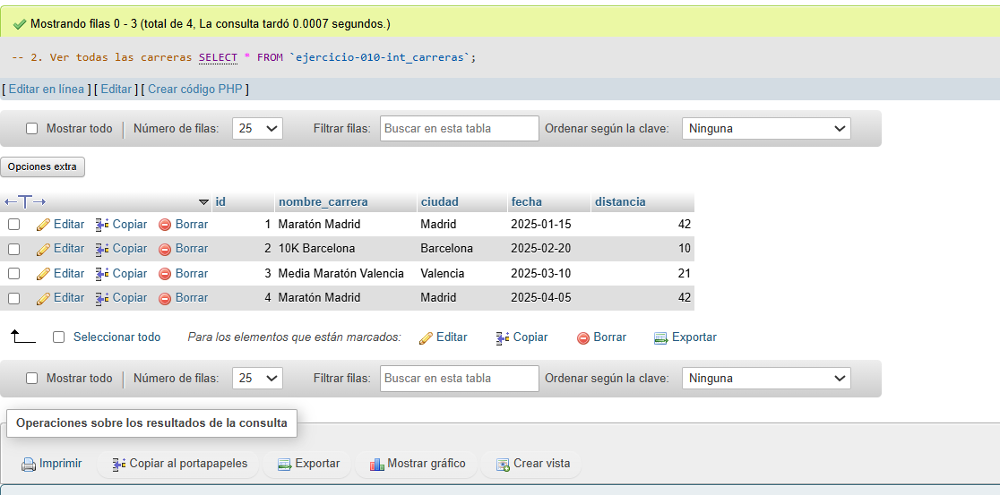
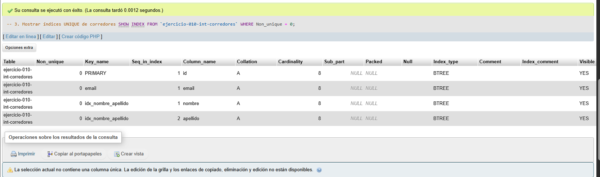
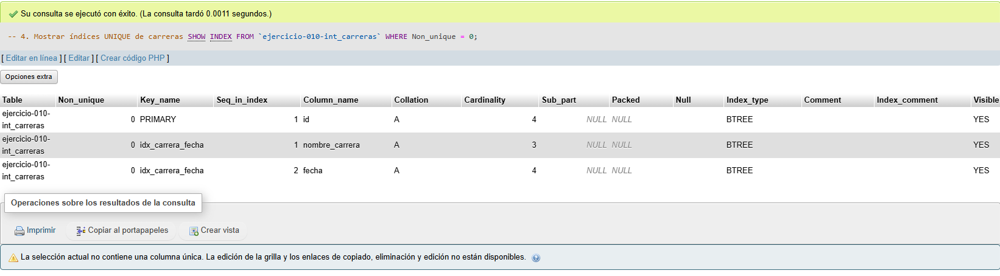
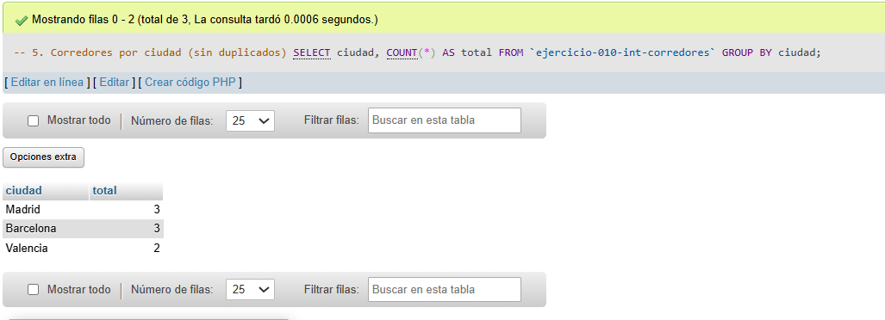
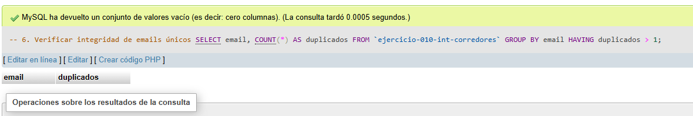

# Ejercicio 010 - Nivel Intermedio - UNIQUE Carreras Urbanas

## 1. Temática

Carreras urbanas con restricciones UNIQUE para evitar duplicados en emails, nombres compuestos y eventos.

## 2. Decisiones Técnicas

- **Diseño de Tablas (DDL):**
  - Tabla de corredores: `ejercicio-010-int-corredores`.
  - Tabla de carreras: `ejercicio-010-int_carreras`.
  - Uso de comillas invertidas para nombres con guiones.

- **Restricciones UNIQUE aplicadas:**
  - `email` UNIQUE: Cada corredor tiene email único.
  - `UNIQUE KEY idx_nombre_apellido`: Combinación nombre+apellido única.
  - `UNIQUE KEY idx_carrera_fecha`: Combinación nombre_carrera+fecha única.

- **Ventajas de UNIQUE:**
  - Evita datos duplicados.
  - Mantiene integridad de datos.
  - Funciona como índice para mejorar velocidad.
  - Permite UNIQUE compuesto (múltiples columnas).

- **Inserción de Datos (DML):**
  - 8 corredores con emails únicos.
  - 4 carreras con combinaciones únicas.
  - Comentarios con ejemplos de errores por duplicados.

- **Consultas (DQL):**
  - SHOW INDEX para ver restricciones.
  - Verificación de integridad con GROUP BY.

## 3. Evidencias

*A continuación, se adjuntan capturas de pantalla que demuestran la ejecución y los resultados de los scripts SQL en phpMyAdmin.*

Definición de tablas e inserción de datos

Consulta 1

Consulta 2

Consulta 3

Consulta 4

Consulta 5

Consulta 6

