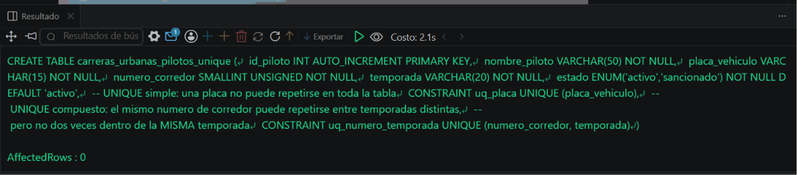
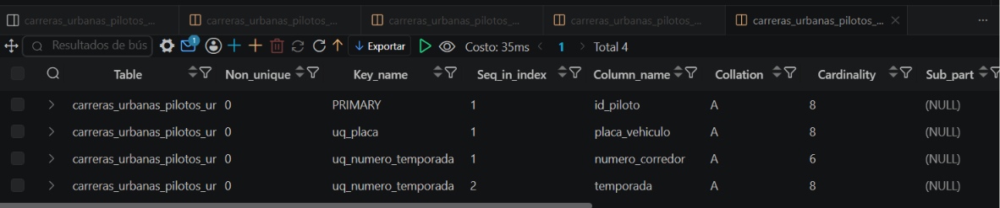

# Resolucion - Ejercicio 010 (Intermedio) - Selvin Lem

## Tematica
Carreras urbanas

## Como ejecutar
1. Ejecutar `ddl/schema.sql`: crea la tabla con UNIQUE simple
   (placa) y UNIQUE compuesto (numero_corredor + temporada).
2. Ejecutar `dml/inserts.sql`: inserta 8 pilotos validos (incluyendo
   el numero 7 repetido en temporadas distintas) y 2 intentos que
   deben fallar por violar las restricciones UNIQUE.
3. Ejecutar `dql/consultas.sql` para confirmar los casos limite.

## Entidad principal
- Tabla: carreras_urbanas_pilotos_unique
- Restricciones: UNIQUE(placa_vehiculo), UNIQUE(numero_corredor, temporada)

## Restriccion aplicada
UNIQUE simple sobre placa_vehiculo y UNIQUE compuesto sobre
(numero_corredor, temporada).

## Caso limite incluido
El numero 7 se repite valido entre dos temporadas distintas (UNIQUE
compuesto lo permite). Placa duplicada y numero+temporada duplicado
son rechazados como casos invalidos, verificados en consultas.sql.

## Evidencia ejecucion - schema.sql
 
 
## Evidencia ejecucion - inserts.sql
 