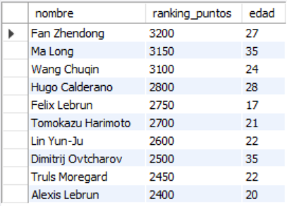
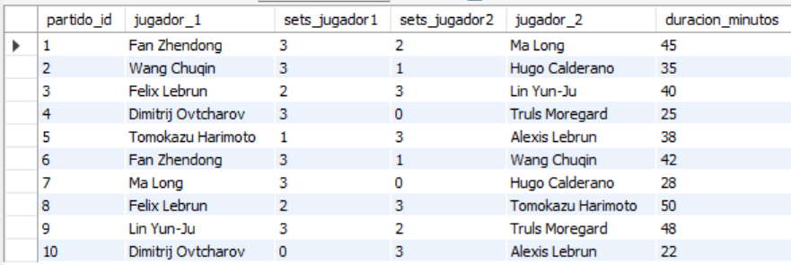
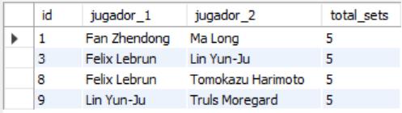
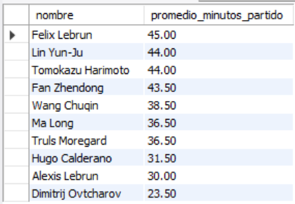
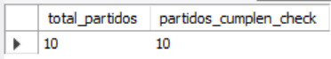

# Ejercicio Intermedio 011 - Restricción CHECK

**Camper:** Antonio Canux

## Descripción

Undécimo ejercicio de nivel intermedio, enfocado en un módulo de datos de tenis de mesa (pingpong). El objetivo técnico fundamental de esta práctica es implementar y auditar la restricción **`CHECK`** en MySQL. La cláusula `CHECK` permite definir expresiones lógicas a nivel de columna o de tabla para asegurar que solo se inserten o actualicen valores que cumplan condiciones del negocio, como rangos numéricos válidos, marcadores matemáticamente posibles y prevención de auto-enfrentamientos.

---

## Tablas utilizadas

**intermedio_ejercicio_011_jugadores**
- id (PK)
- nombre
- ranking_puntos (CHECK >= 0)
- edad (CHECK >= 12)

**intermedio_ejercicio_011_partidos**
- id (PK)
- jugador1_id (FK)
- jugador2_id (FK)
- sets_jugador1 (CHECK >= 0)
- sets_jugador2 (CHECK >= 0)
- duracion_minutos (CHECK > 0)
- *Constraint de Tabla:* `CHECK (jugador1_id <> jugador2_id)`
- *Constraint de Tabla:* `CHECK ((sets_jugador1 + sets_jugador2) <= 5)`

---

## Consultas realizadas

### 1. ¿Cuál es el ranking actual de los jugadores activos con puntaje válido?

```sql
SELECT nombre, ranking_puntos, edad 
    FROM intermedio_ejercicio_011_jugadores 
    ORDER BY ranking_puntos DESC
```

**Resultado**



---

### 2. ¿Cuál es el resultado completo de los partidos cruzando los nombres de ambos competidores y su duración?

```sql
SELECT p.id AS partido_id, j1.nombre AS jugador_1, p.sets_jugador1, p.sets_jugador2, j2.nombre AS jugador_2, p.duracion_minutos 
    FROM intermedio_ejercicio_011_partidos p 
    JOIN intermedio_ejercicio_011_jugadores j1 ON p.jugador1_id = j1.id 
    JOIN intermedio_ejercicio_011_jugadores j2 ON p.jugador2_id = j2.id;
```

**Resultado**



---

### 3. ¿Qué partidos llegaron al límite máximo de 5 sets permitido por la restricción `CHECK`?

```sql
SELECT p.id, j1.nombre AS jugador_1, j2.nombre AS jugador_2, (p.sets_jugador1 + p.sets_jugador2) AS total_sets 
    FROM intermedio_ejercicio_011_partidos p 
    JOIN intermedio_ejercicio_011_jugadores j1 ON p.jugador1_id = j1.id 
    JOIN intermedio_ejercicio_011_jugadores j2 ON p.jugador2_id = j2.id 
    WHERE (p.sets_jugador1 + p.sets_jugador2) = 5;
```

**Resultado**



---

### 4. ¿Cuál es el promedio de minutos jugados por competidor evaluando ambos lados de la mesa?

```sql
SELECT j.nombre, ROUND(AVG(t.duracion_minutos), 2) AS promedio_minutos_partido 
    FROM intermedio_ejercicio_011_jugadores j 
    JOIN (
        SELECT jugador1_id AS jugador_id, duracion_minutos 
        FROM intermedio_ejercicio_011_partidos
        UNION ALL
        SELECT jugador2_id AS jugador_id, duracion_minutos 
        FROM intermedio_ejercicio_011_partidos
    ) t ON j.id = t.jugador_id GROUP BY j.id, j.nombre 
    ORDER BY promedio_minutos_partido DESC;
```

**Resultado**



---

### 5. ¿Cómo verificar estadísticamente el cumplimiento estricto de las reglas `CHECK` en el historial de partidos?

```sql
SELECT COUNT(id) AS total_partidos, SUM(CASE WHEN sets_jugador1 >= 0 AND sets_jugador2 >= 0 AND (sets_jugador1 + sets_jugador2) <= 5 THEN 1 ELSE 0 END) AS partidos_cumplen_check 
    FROM intermedio_ejercicio_011_partidos;
```

*(Nota técnica: Intentar ejecutar `INSERT INTO intermedio_ejercicio_011_partidos (jugador1_id, jugador2_id, sets_jugador1, sets_jugador2, duracion_minutos) VALUES (1, 1, 3, 0, 20);` arrojará el Error 3819: Check constraint 'chk_inter_011_jug_distintos' is violated).*

**Resultado**



---

## Herramientas

- MySQL
- MySQL Workbench
- Git
- GitHub

---

**Campuslands · Skill SQL**