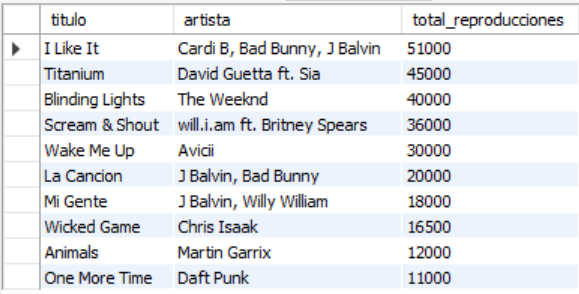
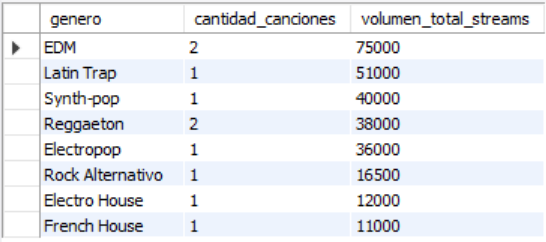
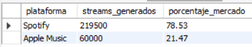
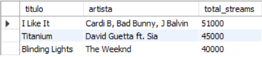
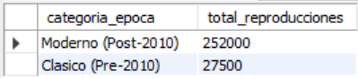

# Ejercicio Intermedio 012 - Consultas de Reportes

**Camper:** Antonio Canux

## Descripción

Duodécimo ejercicio de nivel intermedio, enfocado en un módulo de datos de una playlist y streaming musical. El objetivo de esta práctica es dominar las **Consultas de Reportes**. A diferencia de las consultas transaccionales, los reportes requieren sintetizar grandes volúmenes de datos en información útil para la toma de decisiones. Para lograrlo, utilizamos funciones de agregación (`SUM`, `COUNT`), cruces (`JOIN`), agrupaciones estructuradas (`GROUP BY`), subconsultas para porcentajes, y condicionales (`CASE`) que categorizan datos al vuelo.

---

## Tablas utilizadas

**intermedio_ejercicio_012_canciones**
- id (PK)
- titulo
- artista
- genero
- anio_lanzamiento

**intermedio_ejercicio_012_reproducciones**
- id (PK)
- cancion_id (FK)
- fecha_registro
- streams_totales
- plataforma

---

## Consultas realizadas

### 1. ¿Cuál es el consolidado total de reproducciones generadas por cada canción?

```sql
SELECT c.titulo, c.artista, SUM(r.streams_totales) AS total_reproducciones 
    FROM intermedio_ejercicio_012_canciones c 
    JOIN intermedio_ejercicio_012_reproducciones r ON c.id = r.cancion_id 
    GROUP BY c.id, c.titulo, c.artista 
    ORDER BY total_reproducciones DESC;
```

**Resultado**



---

### 2. ¿Qué género musical atrae el mayor volumen de escuchas y con cuántas pistas cuenta?

```sql
SELECT c.genero, COUNT(DISTINCT c.id) AS cantidad_canciones, SUM(r.streams_totales) AS volumen_total_streams 
    FROM intermedio_ejercicio_012_canciones c 
    JOIN intermedio_ejercicio_012_reproducciones r ON c.id = r.cancion_id 
    GROUP BY c.genero 
    ORDER BY volumen_total_streams DESC;
```

**Resultado**



---

### 3. ¿Cuál es la cuota de mercado (porcentaje) que abarca cada plataforma de streaming?

```sql
SELECT r.plataforma, SUM(r.streams_totales) AS streams_generados, ROUND((SUM(r.streams_totales) / (SELECT SUM(streams_totales) 
    FROM intermedio_ejercicio_012_reproducciones)) * 100, 2) AS porcentaje_mercado 
    FROM intermedio_ejercicio_012_reproducciones r 
    GROUP BY r.plataforma 
    ORDER BY streams_generados DESC;
```

**Resultado**



---

### 4. ¿Cuál es el Top 3 histórico (ideal para armar un setlist principal de un festival)?

```sql
SELECT c.titulo, c.artista, SUM(r.streams_totales) AS total_streams 
    FROM intermedio_ejercicio_012_canciones c 
    JOIN intermedio_ejercicio_012_reproducciones r ON c.id = r.cancion_id 
    GROUP BY c.id, c.titulo, c.artista 
    ORDER BY total_streams DESC 
    LIMIT 3;
```

**Resultado**



---

### 5. ¿Cómo se distribuyen los streams al categorizar el catálogo en música "Clásica" vs "Moderna"?

```sql
SELECT CASE WHEN c.anio_lanzamiento <= 2010 THEN 'Clasico (Pre-2010)' ELSE 'Moderno (Post-2010)' END AS categoria_epoca, SUM(r.streams_totales) AS total_reproducciones 
    FROM intermedio_ejercicio_012_canciones c 
    JOIN intermedio_ejercicio_012_reproducciones r ON c.id = r.cancion_id 
    GROUP BY categoria_epoca 
    ORDER BY total_reproducciones DESC;
```

**Resultado**



---

## Herramientas

- MySQL
- MySQL Workbench
- Git
- GitHub

---

**Campuslands · Skill SQL**