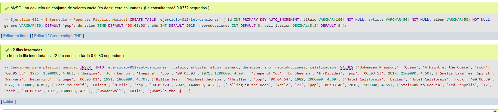
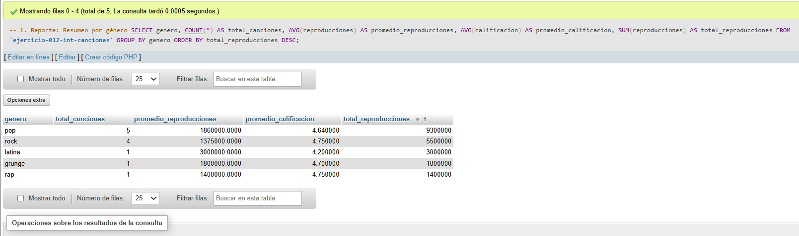
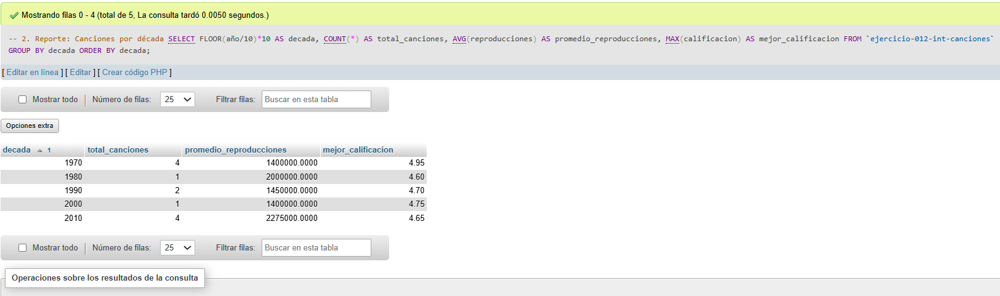
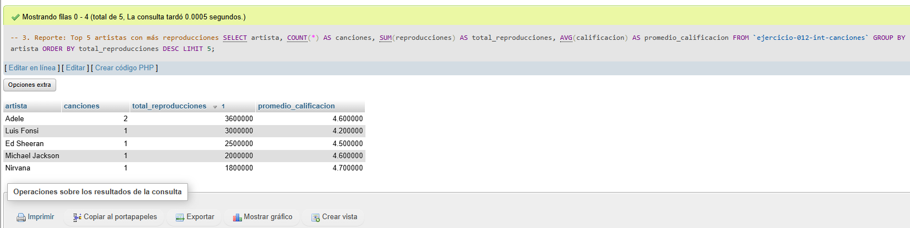
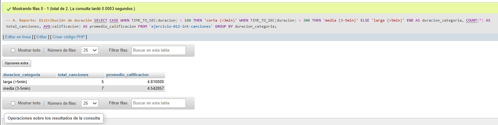
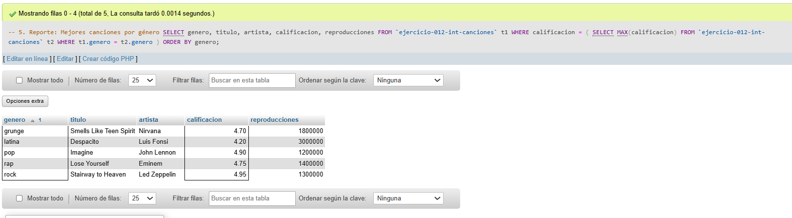

# Ejercicio 012 - Nivel Intermedio - Reportes Playlist Musical

## 1. Temática

Playlist musical con consultas de reportes para analizar datos de canciones.

## 2. Decisiones Técnicas

- **Diseño de Tablas (DDL):**
  - Una tabla: `ejercicio-012-int-canciones`.
  - Columnas: `id`, `titulo`, `artista`, `album`, `genero`, `duracion`, `año`, `reproducciones`, `calificacion`.
  - Uso de comillas invertidas para nombres con guiones.

- **Inserción de Datos (DML):**
  - 12 canciones de diferentes géneros, décadas y artistas.
  - Datos variados para reportes significativos.

- **Tipos de reportes:**
  - **Resumen por género:** Canciones, reproducciones y calificaciones.
  - **Análisis por década:** Agrupación por década (1970, 1980, etc.).
  - **Top artistas:** Los 5 artistas con más reproducciones.
  - **Distribución de duración:** Categorías corta, media, larga.
  - **Mejores por género:** La canción mejor calificada de cada género.

- **Funciones y técnicas usadas:**
  - `GROUP BY` para agrupaciones.
  - `FLOOR(año/10)*10` para agrupar por década.
  - `TIME_TO_SEC()` para convertir duración a segundos.
  - `CASE` para categorizar datos.
  - Subconsultas para encontrar máximos por grupo.
  - `ORDER BY` y `LIMIT` para tops.

## 3. Evidencias

*A continuación, se adjuntan capturas de pantalla que demuestran la ejecución y los resultados de los scripts SQL en phpMyAdmin.*

Definición de tablas e inserción de datos

Consulta 1

Consulta 2

Consulta 3

Consulta 4

Consulta 5

