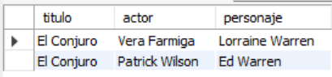
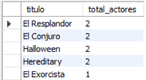
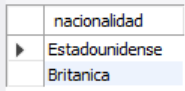
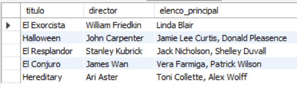

# Ejercicio Intermedio 013 - Tablas Puente

**Camper:** Antonio Canux

## Descripción

Decimotercer ejercicio de nivel intermedio, enfocado en un módulo de datos de un catálogo de películas de miedo. El objetivo técnico es implementar el diseño y consulta de **Tablas Puente**. Una tabla puente se utiliza para resolver una relación de Muchos a Muchos (M:N) en bases de datos relacionales. En este contexto, una película de terror puede tener muchos actores en su reparto, y un actor puede participar en múltiples películas. La tabla intermedia (`reparto`) almacena las llaves foráneas de ambas entidades y, además, guarda datos propios de esa relación (el nombre del `personaje`).

---

## Tablas utilizadas

**intermedio_ejercicio_013_peliculas**
- id (PK)
- titulo
- director
- anio_estreno

**intermedio_ejercicio_013_actores**
- id (PK)
- nombre
- nacionalidad

**intermedio_ejercicio_013_reparto** (Tabla Puente)
- pelicula_id (FK, PK)
- actor_id (FK, PK)
- personaje

---

## Consultas realizadas

### 1. ¿Cuál es el elenco completo y los personajes de la película 'El Conjuro'?

```sql
SELECT p.titulo, a.nombre AS actor, r.personaje 
    FROM intermedio_ejercicio_013_peliculas p 
    JOIN intermedio_ejercicio_013_reparto r ON p.id = r.pelicula_id 
    JOIN intermedio_ejercicio_013_actores a ON r.actor_id = a.id 
    WHERE p.titulo = 'El Conjuro';
```

**Resultado**



---

### 2. ¿En qué películas ha participado la actriz 'Vera Farmiga' y qué personaje interpretó?

```sql
SELECT a.nombre AS actor, p.titulo, r.personaje, p.anio_estreno 
    FROM intermedio_ejercicio_013_actores a 
    JOIN intermedio_ejercicio_013_reparto r ON a.id = r.actor_id 
    JOIN intermedio_ejercicio_013_peliculas p ON r.pelicula_id = p.id 
    WHERE a.nombre = 'Vera Farmiga';
```

**Resultado**


---

### 3. ¿Cuántos actores hay registrados en la base de datos por cada película?

```sql
SELECT p.titulo, COUNT(r.actor_id) AS total_actores 
    FROM intermedio_ejercicio_013_peliculas p LEFT 
    JOIN intermedio_ejercicio_013_reparto r ON p.id = r.pelicula_id 
    GROUP BY p.id, p.titulo 
    ORDER BY total_actores DESC;
```

**Resultado**



---

### 4. ¿Cuáles son las diferentes nacionalidades de los actores que conformaron el reparto de 'Halloween'?

```sql
SELECT DISTINCT a.nacionalidad 
    FROM intermedio_ejercicio_013_actores a 
    JOIN intermedio_ejercicio_013_reparto r ON a.id = r.actor_id 
    JOIN intermedio_ejercicio_013_peliculas p ON r.pelicula_id = p.id 
    WHERE p.titulo = 'Halloween';
```

**Resultado**



---

### 5. ¿Cómo presentar el catálogo agrupando a todo el elenco principal de cada película en una sola columna?

```sql
SELECT p.titulo, p.director, GROUP_CONCAT(a.nombre SEPARATOR ', ') AS elenco_principal 
    FROM intermedio_ejercicio_013_peliculas p 
    JOIN intermedio_ejercicio_013_reparto r ON p.id = r.pelicula_id 
    JOIN intermedio_ejercicio_013_actores a ON r.actor_id = a.id GROUP BY p.id, p.titulo, p.director 
    ORDER BY p.anio_estreno ASC;
```

**Resultado**



---

## Herramientas

- MySQL
- MySQL Workbench
- Git
- GitHub

---

**Campuslands · Skill SQL**