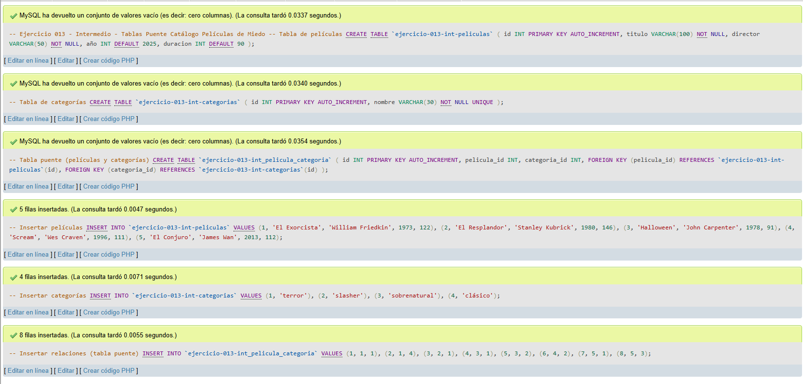
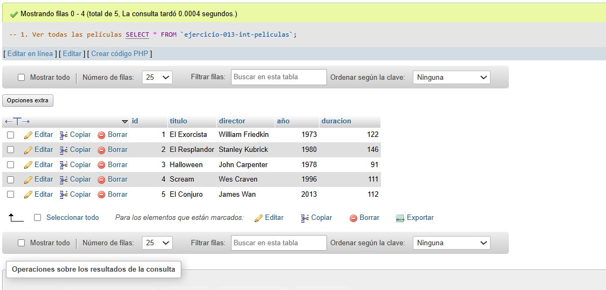
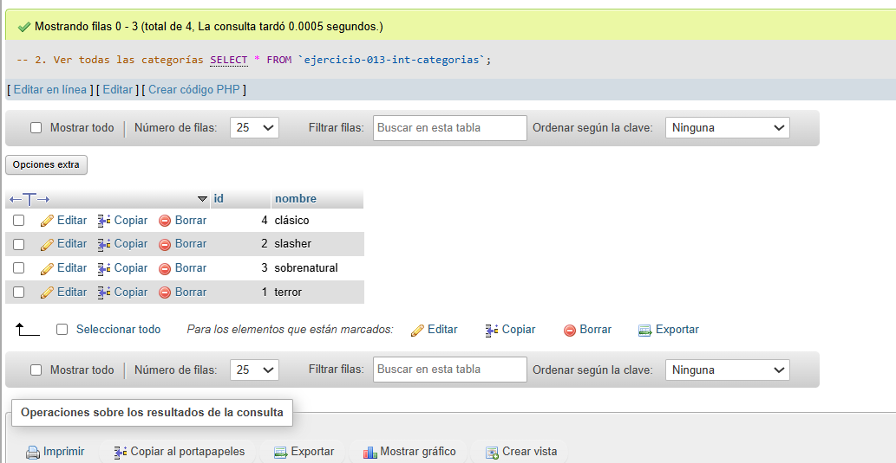
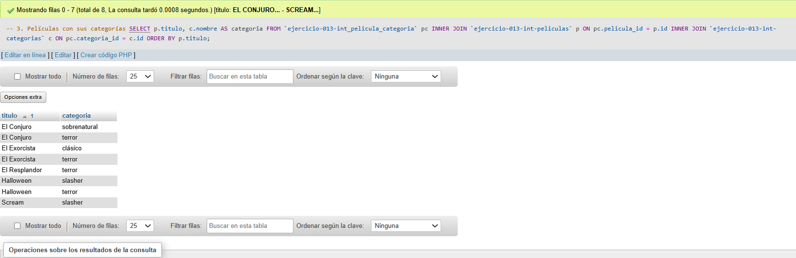
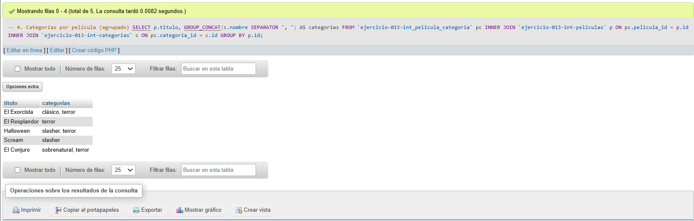
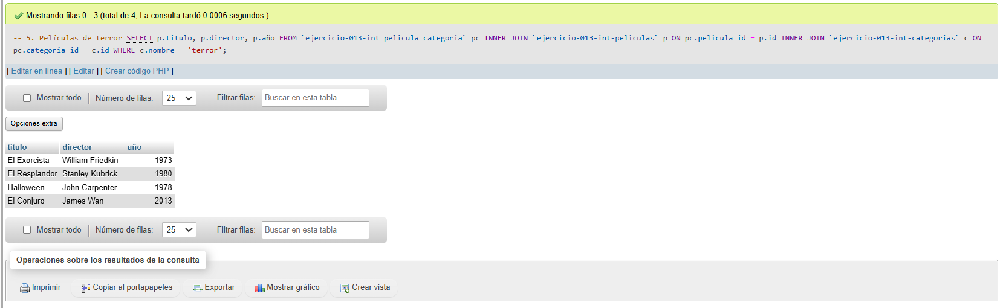

# Ejercicio 013 - Nivel Intermedio - Tablas Puente Catálogo Películas de Miedo

## 1. Temática

Catálogo de películas de miedo con tablas puente para relaciones muchos a muchos.

## 2. Decisiones Técnicas

- **Diseño de Tablas (DDL):**
  - `ejercicio-013-int-peliculas`: Datos de películas.
  - `ejercicio-013-int-categorias`: Catálogo de categorías.
  - `ejercicio-013-int_pelicula_categoria`: Tabla puente con FOREIGN KEY.
  - Uso de comillas invertidas para nombres con guiones.

- **Relación Muchos a Muchos:**
  - Una película puede tener muchas categorías.
  - Una categoría puede pertenecer a muchas películas.
  - Tabla puente con dos llaves foráneas.

- **Inserción de Datos (DML):**
  - 5 películas.
  - 4 categorías (terror, slasher, sobrenatural, clásico).
  - 8 relaciones en tabla puente.

- **Consultas (DQL):**
  - Ver todas las películas y categorías.
  - Películas con sus categorías (JOIN simple).
  - Categorías agrupadas por película con GROUP_CONCAT.
  - Filtrar películas por categoría específica.

- **Ventajas:**
  - Permite múltiples categorías por película.
  - Flexible y escalable.
  - Mantiene integridad referencial.

## 3. Evidencias

*A continuación, se adjuntan capturas de pantalla que demuestran la ejecución y los resultados de los scripts SQL en phpMyAdmin.*

Definición de tablas e inserción de datos

Consulta 1

Consulta 2

Consulta 3

Consulta 4

Consulta 5

