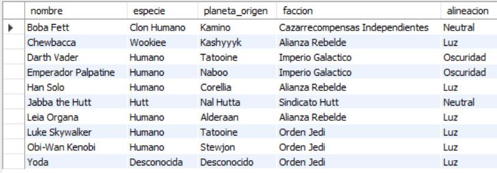
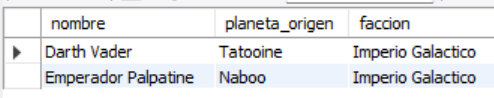
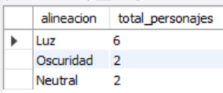
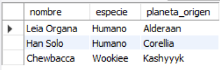

# Ejercicio Intermedio 014 - Vistas Simples

**Camper:** Antonio Canux

## Descripción

Decimocuarto ejercicio de nivel intermedio, enfocado en un módulo de datos del universo de una saga de ciencia ficción (Star Wars). El objetivo técnico es implementar **Vistas Simples (`CREATE VIEW`)**. Las vistas funcionan como "tablas virtuales" que almacenan una consulta predefinida. Son extremadamente útiles a nivel profesional para simplificar consultas complejas (evitando escribir múltiples `JOIN` una y otra vez), mejorar la seguridad restringiendo el acceso a columnas específicas, y facilitar la lectura del código para otros desarrolladores.

---

## Tablas y Vistas utilizadas

**intermedio_ejercicio_014_facciones**
- id (PK)
- nombre
- alineacion (ENUM)

**intermedio_ejercicio_014_personajes**
- id (PK)
- faccion_id (FK)
- nombre
- especie
- planeta_origen

**Vistas Creadas (Views):**
- `vw_inter_014_personajes_completos`: Directorio general con datos cruzados.
- `vw_inter_014_estadisticas_alineacion`: Reporte precalculado.
- `vw_inter_014_heroes_rebeldes`: Subconjunto de datos filtrados creado en DQL.

---

## Consultas realizadas

### 1. ¿Cuál es el directorio completo de personajes utilizando la vista principal?

```sql
SELECT nombre, especie, planeta_origen, faccion, alineacion 
    FROM vw_inter_014_personajes_completos 
    ORDER BY nombre ASC;
```

**Resultado**



---

### 2. ¿Qué personajes pertenecen a la alineación de la Oscuridad (filtrando la vista)?

```sql
SELECT nombre, planeta_origen, faccion 
    FROM vw_inter_014_personajes_completos 
    WHERE alineacion = 'Oscuridad';
```

**Resultado**



---

### 3. ¿Cómo se distribuyen estadísticamente los personajes según su alineación usando la vista de resumen?

```sql
SELECT alineacion, total_personajes 
    FROM vw_inter_014_estadisticas_alineacion 
    ORDER BY total_personajes DESC;
```

**Resultado**



---

### 4. ¿Cómo crear una nueva vista dinámica para un reporte específico (Ej: Héroes Rebeldes)?

```sql
CREATE OR REPLACE VIEW vw_inter_014_heroes_rebeldes AS
    SELECT nombre, especie, planeta_origen
    FROM vw_inter_014_personajes_completos
    WHERE faccion = 'Alianza Rebelde';
```

*(Nota técnica: Esta consulta no retorna datos visuales en tabla, genera el objeto en la base de datos).*

---

### 5. ¿Cuál es el resultado al consultar la nueva vista de Héroes Rebeldes?

```sql
SELECT nombre, especie, planeta_origen 
    FROM vw_inter_014_heroes_rebeldes;
```

**Resultado**



---

## Herramientas

- MySQL
- MySQL Workbench
- Git
- GitHub

---

**Campuslands · Skill SQL**