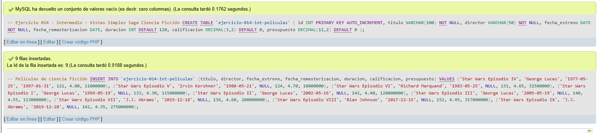
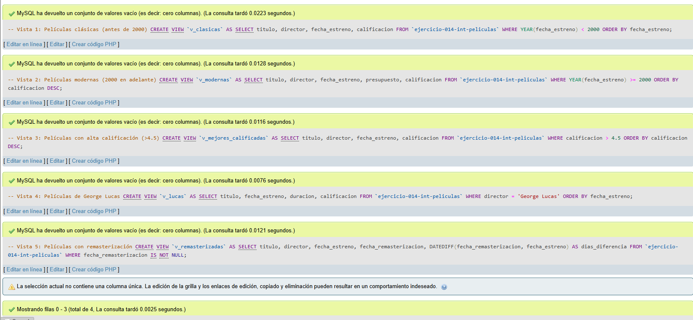
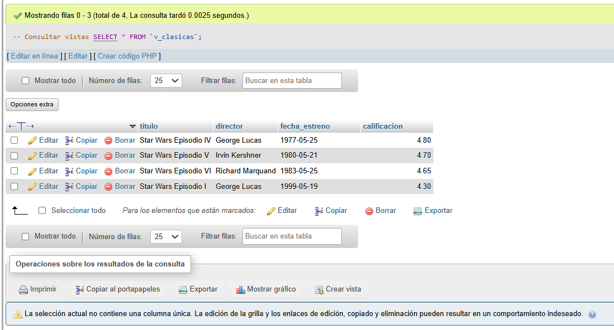
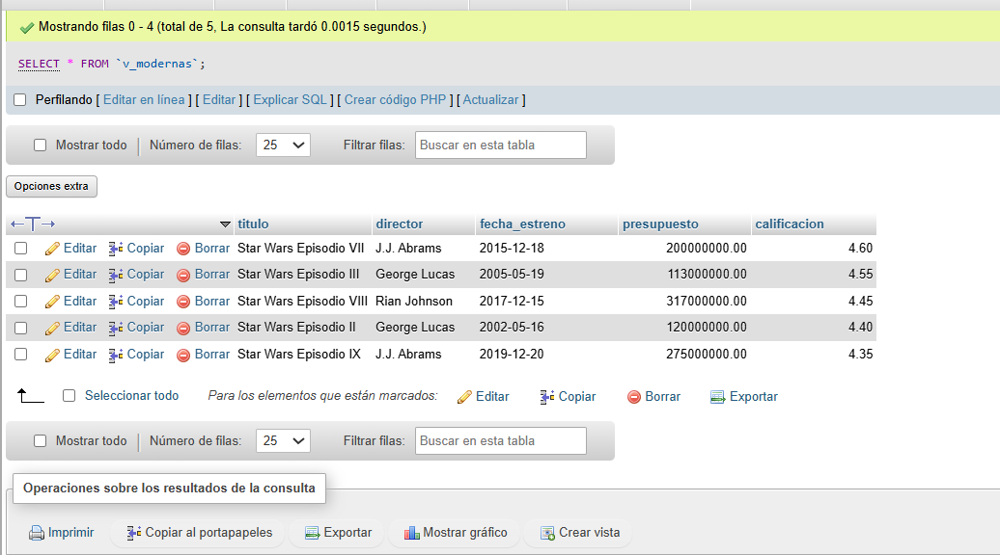
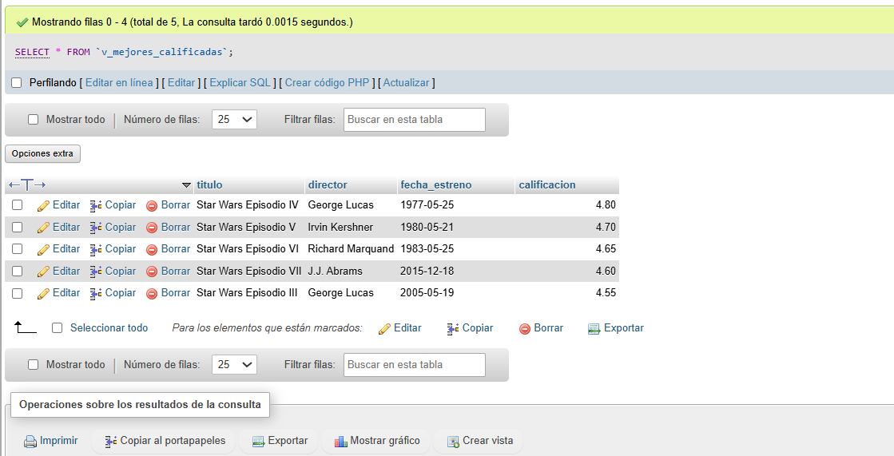
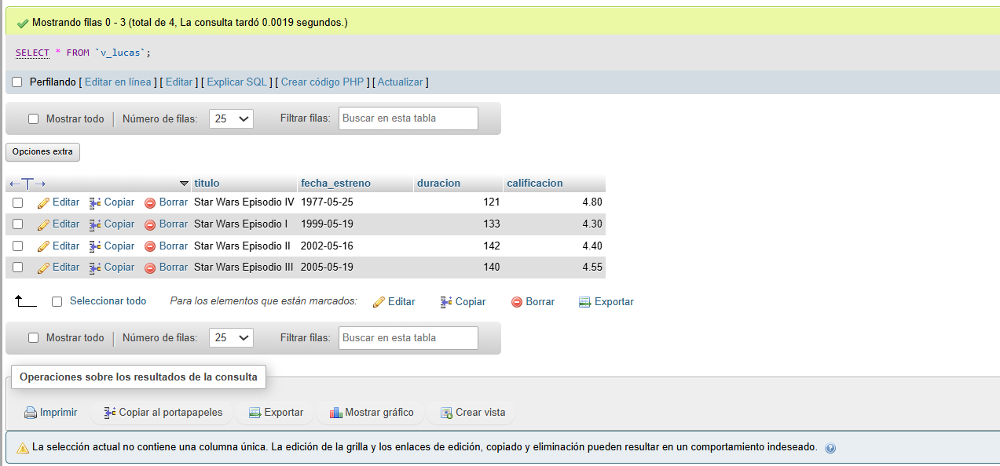
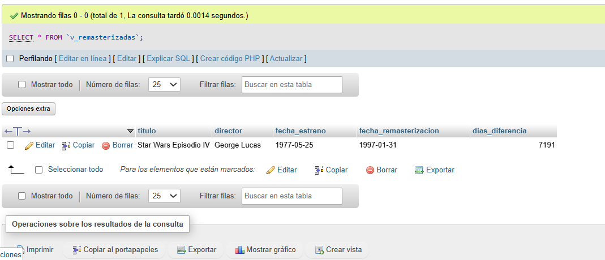

# Ejercicio 014 - Nivel Intermedio - Vistas Simples Saga Ciencia Ficción

## 1. Temática

Saga de ciencia ficción con vistas simples para consultas comunes y reportes.

## 2. Decisiones Técnicas

- **Diseño de Tablas (DDL):**
  - Una tabla: `ejercicio-014-int-peliculas`.
  - Columnas: `id`, `titulo`, `director`, `fecha_estreno`, `fecha_remasterizacion`, `duracion`, `calificacion`, `presupuesto`.
  - Uso de comillas invertidas para nombres con guiones.

- **Inserción de Datos (DML):**
  - 9 películas de Star Wars.
  - Diferentes calificaciones y presupuestos.

- **Vistas creadas:**
  - `v_clasicas`: Películas antes del año 2000.
  - `v_modernas`: Películas del 2000 en adelante.
  - `v_mejores_calificadas`: Calificación > 4.5.
  - `v_lucas`: Películas dirigidas por George Lucas.
  - `v_remasterizadas`: Películas con fecha de remasterización.

- **Ventajas de vistas:**
  - Simplifican consultas repetitivas.
  - Encapsulan lógica de negocio.
  - Mejoran legibilidad.
  - Reutilizables.

- **Consultas (DQL):**
  - Crear vistas con CREATE VIEW.
  - Consultar vistas como tablas normales.
  - Ordenamiento y filtros en vistas.

## 3. Evidencias

*A continuación, se adjuntan capturas de pantalla que demuestran la ejecución y los resultados de los scripts SQL en phpMyAdmin.*

Definición de tablas e inserción de datos

Creación de vistas

Consulta 1

Consulta 2

Consulta 3

Consulta 4

Consulta 5

