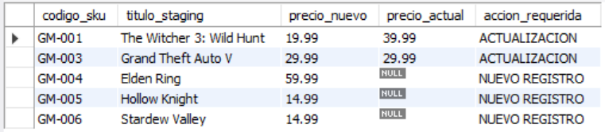
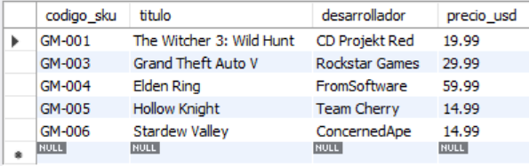
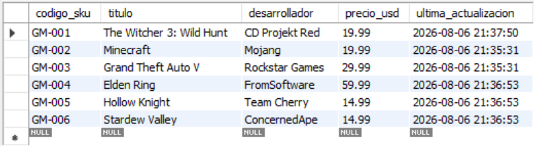

# Ejercicio Intermedio 015 - Carga de Datos (ETL)

**Camper:** Antonio Canux

## Descripción

Decimoquinto y último ejercicio de nivel intermedio, aplicado a un módulo de datos de una biblioteca gamer. El objetivo de esta práctica es implementar estrategias profesionales de **Carga de Datos**. En la industria, rara vez insertamos registros uno a uno; en su lugar, cargamos lotes masivos. Se documenta la sintaxis de `LOAD DATA INFILE` (para ingestar CSVs) y se simula el proceso de transformación usando una tabla puente temporal (`staging`). Finalmente, aplicamos técnicas de carga masiva como **`INSERT IGNORE`** y el poderoso patrón Upsert **`ON DUPLICATE KEY UPDATE`** para insertar registros nuevos y actualizar los existentes en una sola operación.

---

## Tablas utilizadas

**intermedio_ejercicio_015_juegos_produccion** (Tabla Principal)
- codigo_sku (PK)
- titulo
- desarrollador
- precio_usd
- ultima_actualizacion

**intermedio_ejercicio_015_juegos_staging** (Tabla de Carga/Ingesta)
- codigo_sku (PK)
- titulo
- desarrollador
- precio_usd

---

## Consultas realizadas

### 1. ¿Cómo se ve la sentencia SQL profesional para cargar un archivo `.csv` a la tabla staging?

```sql
/*
LOAD DATA LOCAL INFILE '/ruta/al/archivo/lote_juegos.csv'
INTO TABLE intermedio_ejercicio_015_juegos_staging
FIELDS TERMINATED BY ',' ENCLOSED BY '"'
LINES TERMINATED BY '\n'
IGNORE 1 ROWS
(codigo_sku, titulo, desarrollador, precio_usd);
*/
```
*(Se incluye como comentario en el script DQL a modo de documentación, ya que requiere un archivo físico en el servidor).*

---

### 2. ¿Qué datos del lote de carga son videojuegos nuevos y cuáles son actualizaciones de precios?

```sql
SELECT s.codigo_sku, s.titulo AS titulo_staging, s.precio_usd AS precio_nuevo, p.precio_usd AS precio_actual,
CASE WHEN p.codigo_sku IS NULL THEN 'NUEVO REGISTRO' ELSE 'ACTUALIZACION' END AS accion_requerida
    FROM intermedio_ejercicio_015_juegos_staging s
    LEFT JOIN intermedio_ejercicio_015_juegos_produccion p ON s.codigo_sku = p.codigo_sku;
```

**Resultado**



---

### 3. ¿Cómo migrar únicamente los juegos nuevos ignorando los que ya existen para evitar errores? (`INSERT IGNORE`)

```sql
INSERT IGNORE INTO intermedio_ejercicio_015_juegos_produccion (codigo_sku, titulo, desarrollador, precio_usd)
SELECT codigo_sku, titulo, desarrollador, precio_usd 
	FROM intermedio_ejercicio_015_juegos_staging;
```

**Resultado**



---

### 4. ¿Cómo realizar una carga masiva que inserte los juegos nuevos y actualice el precio de los existentes (Upsert)?

```sql
INSERT INTO intermedio_ejercicio_015_juegos_produccion (codigo_sku, titulo, desarrollador, precio_usd)
SELECT codigo_sku, titulo, desarrollador, precio_usd 
	FROM intermedio_ejercicio_015_juegos_staging
	ON DUPLICATE KEY UPDATE precio_usd = VALUES(precio_usd);
```

**Resultado**

---

### 5. ¿Cuál es el estado final de la biblioteca en producción tras finalizar la carga de datos?

```sql
SELECT codigo_sku, titulo, desarrollador, precio_usd, ultima_actualizacion 
    FROM intermedio_ejercicio_015_juegos_produccion 
    ORDER BY codigo_sku ASC;
```

**Resultado**



---

## Herramientas

- MySQL
- MySQL Workbench
- Git
- GitHub

---

**Campuslands · Skill SQL**